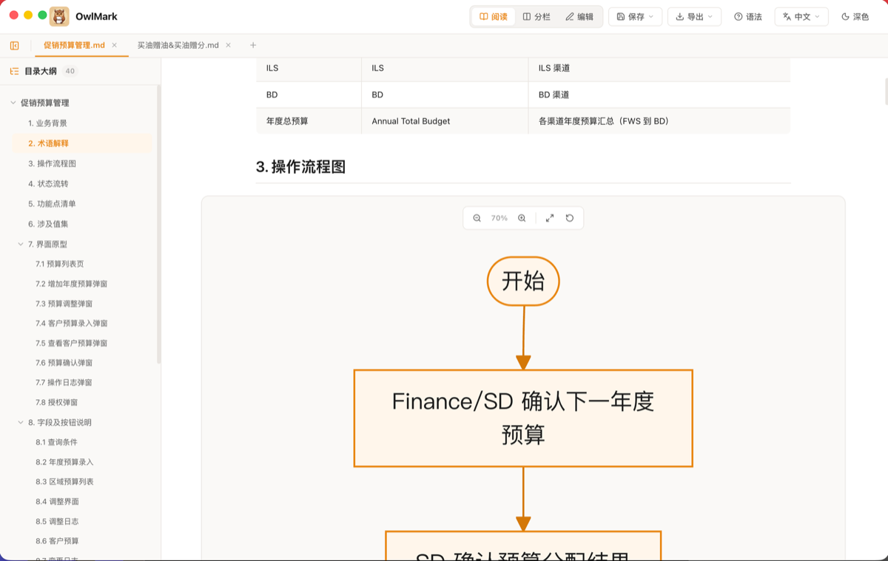
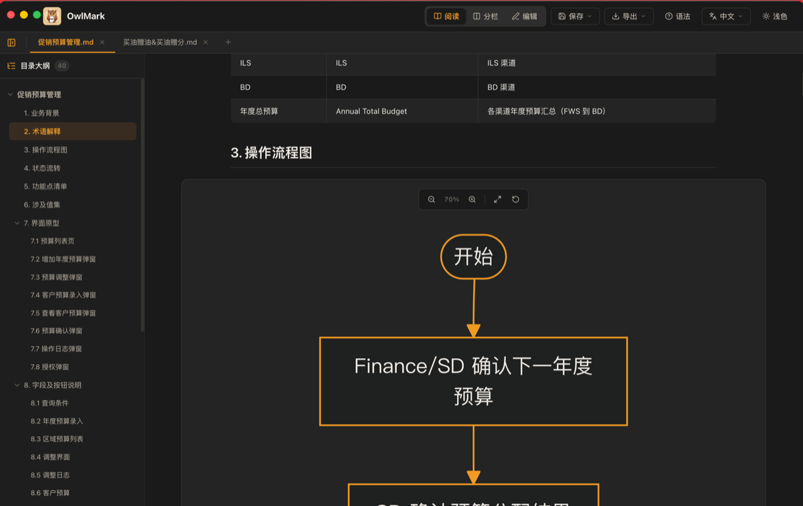
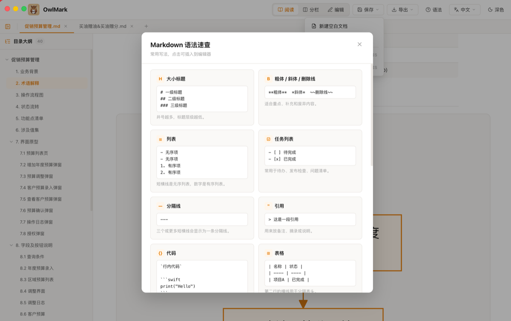
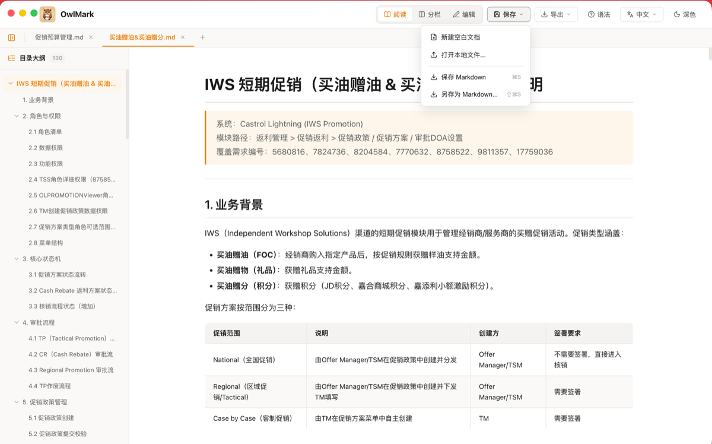
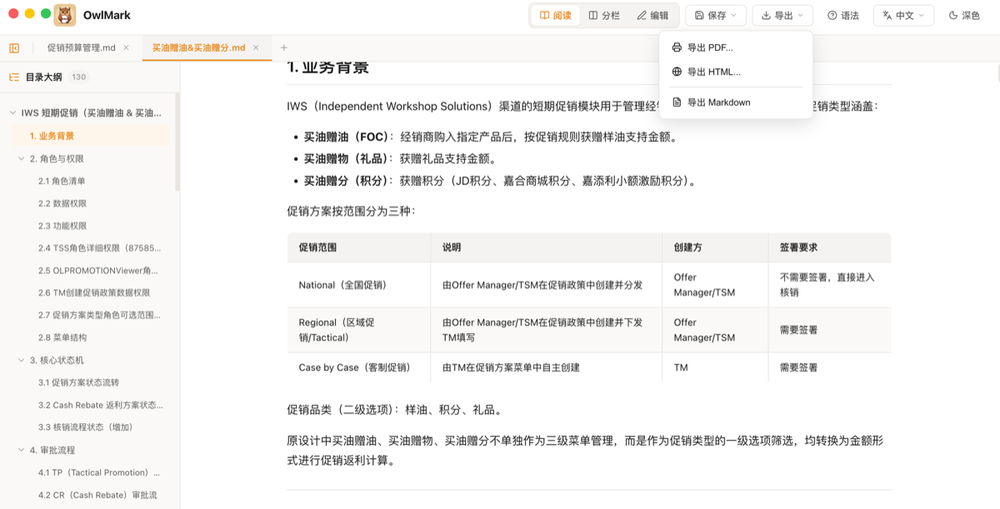

# 🦉 OwlMark

一款功能丰富的 Markdown 桌面编辑器，基于 Electron + React 构建，支持 Mermaid 流程图渲染、多文档 Tab、中英文双语切换。

## ✨ 功能特性

### 📖 多视图模式
- **阅读模式** — 纯渲染预览，专注阅读
- **分栏模式** — 左侧编辑 + 右侧实时预览
- **编辑模式** — 纯文本编辑，高效写作

### �� 多文档 Tab 系统
- 支持同时打开多个 Markdown 文件
- Tab 标签页切换，支持关闭和新建
- 默认加载示例文档

### 🗂️ 侧边目录大纲
- 自动解析标题层级生成目录树
- 支持折叠/展开各级标题
- 点击目录项快速跳转

### 📊 Mermaid 流程图
- 原生支持 Mermaid 语法渲染
- VS Code 风格紧凑布局
- 橙色主题配色
- 支持缩放、拖拽、适应宽度
- 边标签嵌入式视觉效果

### 🌐 中英文双语
- 导航栏语言下拉选择器
- Electron 菜单栏同步切换
- 可扩展支持更多语言

### 💾 文件管理
- 新建空白文档
- 打开本地 .md / .txt 文件
- 保存 Markdown（⌘S）
- 另存为 Markdown（⇧⌘S）

### 📤 导出功能
- 导出 PDF（通过打印对话框）
- 导出 HTML（完整独立页面）
- 导出 Markdown

### 📝 Markdown 语法速查
- 15 项常用语法卡片
- 点击即可插入编辑器
- 覆盖：标题、粗体斜体、列表、任务、分隔线、引用、代码、表格、链接图片、公式、流程图、脚注、高亮、上下标、Emoji

### 🎨 主题
- 浅色 / 深色主题一键切换
- 橙色品牌配色

## 📸 界面预览

### 阅读模式（浅色）


### 阅读模式（深色）


### Markdown 语法速查


### 文件管理菜单


### 导出菜单


## 🛠️ 技术栈

| 技术 | 版本 | 用途 |
|------|------|------|
| React | 19 | UI 框架 |
| Vite | 7 | 构建工具 |
| Electron | 37 | 桌面壳 |
| Mermaid | 11 | 流程图渲染 |
| marked | 16 | Markdown 解析 |
| DOMPurify | 3 | XSS 防护 |
| lucide-react | — | 图标库 |

## 🚀 开发

```bash
# 安装依赖
npm install

# 开发模式（Vite + Electron）
npm run dev

# 构建 Web 版本
npm run build

# 构建 macOS DMG 安装包
npm run build:mac
```

## 📦 安装

从 [Releases](../../releases) 页面下载对应平台的安装包：
- **macOS (ARM64)**: `OwlMark-x.x.x-arm64.dmg`

## 📄 License

MIT
